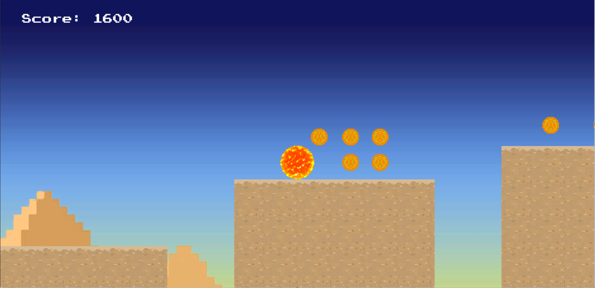

# Eye of Horus

Eye of Horus is a 2D platformer developed in unity. The game let's you play as one of Horus' eyes the sun. The ancient egyptian god is said to have the sun as his left eye and the moon as his right eye. 

In the game your task is to reach the finish line. However, there are obstacles in your way in the form of scalable walls or pressure plates that need activation. Can you make it? 

P.S All assets were drawn by me for fun as a way to do something outside my comfort zone, don't be too harsh.
